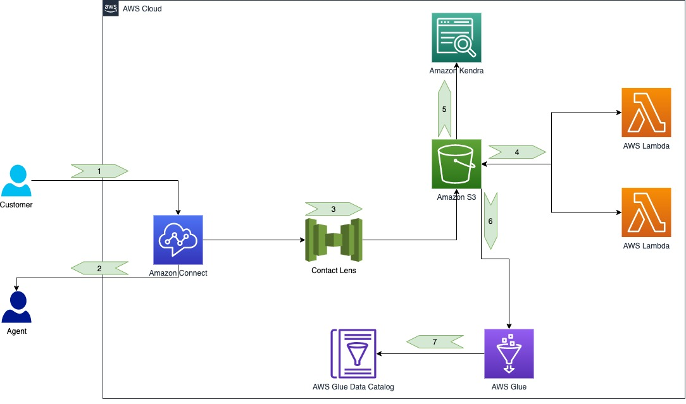
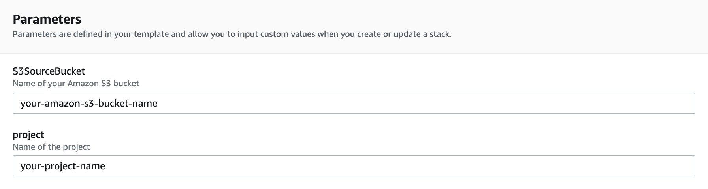

# Get value from every customer touchpoint using Amazon Connect as a data gathering mechanism

## Solution overview

The flow of this architecture is as follows:

* A customer calls your call center in the cloud.
* Amazon Connect connects the customer to an agent. As an alternative, the agent can start an outbound call to reach a customer.
* When the call is complete, Contact Lens starts transcribing the recorded call and runs sentiment analysis on the transcripts. It stores all artifacts in Amazon Simple Storage Service (Amazon S3) buckets.
* As new documents are saved to the corresponding Amazon S3 locations, two AWS Lambda functions, one for chat the other for voice contacts, extract data of interest and write the wrangled data back to Amazon S3.
* On some of the data the Lambda functions stored, Amazon Kendra regularly updates a search index.
* A similar scheduling concept is applied using an AWS Glue crawler.
* The crawler updates our AWS Glue Data Catalog, which makes it easy to search our terms, for example, with Amazon Athena.

Your Amazon Kendra data source is scheduled to update itself every day at 10 AM. This way, your Amazon Kendra index stays up to date. If you created the solution components after 10 AM, you can either wait until the next automatic sync, or trigger the synchronization of your data sources in your index via the Amazon Kendra console. For more information, see Using an Amazon S3 data source.

## Deploy the data gathering resources

As a first step, we want to deploy all resources, except for the Amazon Connect instance, using an AWS CloudFormation template. You can do this by choosing Launch Stack:

Define the name of your new S3 bucket and project.

You’re now ready to set up Amazon Connect and the associated contact flow.

## Use the example jupyter notebooks

To get started, we provide a full example in a Jupyter notebook that shows you how to train and deploy your proprietary model as a SageMaker endpoint.

In the example, we process the text from customer calls and use a text classification algorithm (Object2Vect) to perform sentiment analysis. We assume the sentiment analysis model is already available.

## Security

See [CONTRIBUTING](CONTRIBUTING.md#security-issue-notifications) for more information.

## License

This library is licensed under the MIT-0 License. See the LICENSE file.

